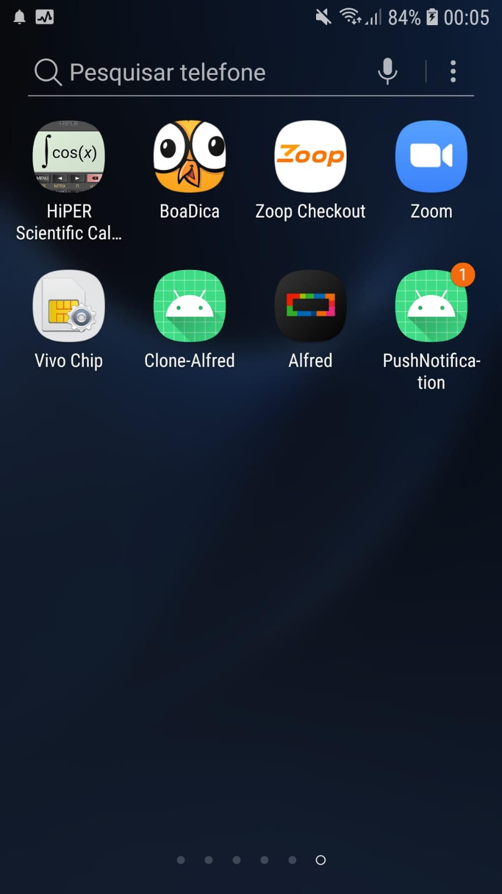

# Push Notification - App
  
Funcionalidade do aplicativo esta no envio e recebimento de notificações, usando a API do Firebase. As notificações podem ser envidas usando o console do Firebase ou pelo botão configurado no aplicativo.

## Screenshots

<p>
 
 
 
 
</p>

## Configuração do Firebase no Gradle

É necessário realizar a configuração e ativação do aplicativo junto da criação do projeto junto ao Firebase. É importante adicionar o arquivo 
google-service.json (disponivel dentro projeto na aba Configuração do projeto/Geral) dentro da pasta /app.

- [Passos para ativacao do Firebase Cloud Messaging](https://firebase.google.com/docs/cloud-messaging/?hl=pt-br)

```build.gradle
//build.gradle - Project
buildscript {
    ...
    dependencies {
        ...
        classpath 'com.google.gms:google-services:4.3.10'
    }
}
   
//build.gradle - Module
dependencies {
    ...
    
    implementation platform('com.google.firebase:firebase-bom:29.0.1')
    implementation 'com.google.firebase:firebase-analytics'
    implementation 'com.google.firebase:firebase-messaging'
}
``` 
## Configuração do arquivo local.properties  

Dentro do arquivo local.properties e necessário criar duas variáveis que devem ter acesso ao project_id e key_api, ambos localizados dentro  do projeto criado no Firebase na aba Configuração do Projeto\Cloud Messaging.

```local.properties
  KEY_API=CHAVE_SERVIDOR
  PROJECT_ID=ID_DO_REMETENTE
  BASE_URL="https://fcm.googleapis.com/fcm/"
```
```build.gradle
//build.gradle - Project
buildTypes {
    ...
    
    debug{
       def localProperties = new Properties()
       localProperties.load(new FileInputStream(rootProject.file("local.properties")))
       buildConfigField('String', 'KEY_API', localProperties['KEY_API'])
       buildConfigField('String', 'PROJECT_ID', localProperties['PROJECT_ID'])
   }
}
```
## Recuperar o token do Device

Para recuperar o token do dispositivo e necessário utilizar da função disponibilizada pelo Firebase.

```kotlin
 FirebaseMessaging.getInstance().token.addOnCompleteListener(OnCompleteListener { task ->
      if (!task.isSuccessful) {
          Log.w(TAG, "Fetching FCM registration token failed", task.exception)
          return@OnCompleteListener
      }

      val token = task.result
      if (token != null) {
          PreferencesHelpers(this).setToken(token)
          Log.w(TAG, "Token ${PreferencesHelpers(this).getToken()}")
      }

      Log.w(TAG, "$token")
  })
```
## Enviando Notificacao usando a API do Firebase

A equipe do Firebase disponibiliza de um endpoint para enviar uma notificação, porem e necessário seguir um passo a passo para notificação ser enviada co sucesso.

- [fcm.googleapis.com/send](https://fcm.googleapis.com/fcm/send)

## Enviar alguns dados no Header
- Content-Type : application/json
- project_id : PROJECT_ID (Configurado no arquilo local.properties)
- Authorization: KEI_API (Configurado no arquilo local.properties)

## Exemplo chamada em Kotlin
```kotlin
  @POST("send")
    fun send(
        @Header("Content-Type") type: String = "application/json",
        @Header("project_id") project_id: String = BuildConfig.PROJECT_ID,
        @Header("Authorization") auto1: String = "key=${BuildConfig.KEY_API}",
        @Body request: NotificationRequest?
    ): Call<NotificationResponse>
```
## Corpo da requisição
```JSON
{
   "data":{
      "name":"Name data",
      "type":"Type data"
   },
   "notification":{
      "body":"Send notification using API",
      "mutable_content":true,
      "sound":"Tri-tone",
      "title":"Push Notification"
   },
   "to":"TOKEN_DEVICE"
}
```

## Service para executar a notificação

Nesta classe serve como listener para notificar o usuário a cada nova notificação recebida.

```kotlin
class MyFirebaseMessagingService: FirebaseMessagingService() {

    override fun onMessageReceived(remoteMessage: RemoteMessage) {
        super.onMessageReceived(remoteMessage)
        Log.i(TAG, "remoteMessage: ${remoteMessage.data}")
        Log.i(TAG, "From: ${remoteMessage.from}")

        if (remoteMessage.data.isNotEmpty()) {
            Log.i(TAG, "Message data payload: ${remoteMessage.data}")
        }

        remoteMessage.notification?.let {
            Log.i(TAG, "Message Notification Body: ${it.body}")
            showNotification(it.body)
        }
    }
 }
```
 
